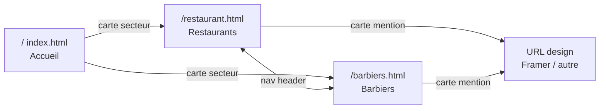

# Fixbyte GH Pages — plan principal

| | |
|---|---|
| **Stack** | HTML / CSS / JS vanilla (sans framework) |
| **Langue** | Français |
| **Marque** | Fixbyte |
| **Domaine** | [studio.fixbyte.be](https://studio.fixbyte.be) |
| **Hébergement** | GitHub Pages (branche `main`, racine `/`) |

---

## Architecture



### Pages

| Fichier | Rôle | Nav header |
|---|---|---|
| [`index.html`](../../index.html) | Accueil — 2 cartes secteur | — (logo seulement) |
| [`restaurant.html`](../../restaurant.html) | Grille designs restaurants | **Restaurants** (actif) |
| [`barbiers.html`](../../barbiers.html) | Grille designs barbiers | **Barbiers** (actif) |

- Logo Fixbyte → `index.html` (retour accueil)
- Nav header : **Restaurants | Barbiers** uniquement — pas de lien « Accueil »
- Header, footer et styles partagés ; seuls le titre, le JSON et le libellé changent

---

## Wireframe — pages métier

```text
+----------------------------------------------------------+
|  [logo Fixbyte]          Restaurants  |  Barbiers        |
+----------------------------------------------------------+
|                                                          |
|  Designs restaurants                    (ou Barbiers)    |
|  Réalisations Fixbyte — aperçus cliquables               |
|                                                          |
|  +------------------+  +------------------+  +--------+  |
|  | [og:image]       |  | [og:image]       |  |  ...   |  |
|  | Titre OG         |  | Titre OG         |  |        |  |
|  | Description OG   |  | Description OG   |  |        |  |
|  | domaine ↗        |  | domaine ↗        |  |        |  |
|  +------------------+  +------------------+  +--------+  |
|                                                          |
+----------------------------------------------------------+
|  Tarifs                                                  |
|  Les grilles tarifaires seront publiées ici prochainement|
|  [slots skeleton prêts à remplir]                        |
+----------------------------------------------------------+
|  Fixbyte  ·  studio.fixbyte.be                         |
+----------------------------------------------------------+
```

### Sections

**Header**
- Logo à gauche (lien accueil)
- Nav : Restaurants | Barbiers — lien actif souligné / contraste

**Hero**
- H1 : `Designs restaurants` ou `Designs barbiers`
- Accroche : présentation des travaux, clic = ouverture du design

**Grille de cartes mention**
- `<a href="{url}" target="_blank" rel="noopener noreferrer">`
- Image OG → titre → description (2 lignes max) → hôte + icône ↗
- Fallback : screenshot Microlink → [`assets/placeholder.svg`](../../assets/placeholder.svg)

**Tarifs** *(placeholder)*
- Titre `Tarifs` + texte « publiées prochainement »
- 2–3 cartes skeleton (nom + prix `—`)

**Footer**
- `Fixbyte` · année · domaine

---

## Cartes mention — Microlink

Données dans le JSON, jamais en dur dans le HTML :

- [`data/restaurants.json`](../../data/restaurants.json)
- [`data/barbiers.json`](../../data/barbiers.json)

```json
[
  { "url": "https://exemple-design.fr/projet-1" }
]
```

[`js/cards.js`](../../js/cards.js) — logique partagée :

1. Lit le JSON de la page courante
2. `GET https://api.microlink.io/?url=ENCODED` pour chaque URL
3. Affiche `data.image.url` (sinon screenshot, sinon placeholder)
4. Titre / description depuis la réponse Microlink
5. Cache `localStorage` (clé = URL, TTL ~24 h) — quota gratuit ~50 req/jour
6. Skeleton pendant le chargement

Fallback image directe : `https://api.microlink.io/?url=...&embed=image.url`

---

## Arborescence

```text
index.html              # Accueil
restaurant.html         # Restaurants
barbiers.html           # Barbiers
css/style.css           # Layout, cartes, tarifs, responsive
js/cards.js             # Microlink + rendu des cartes
data/
  restaurants.json
  barbiers.json
assets/
  logo-dark.svg
  logo-light.svg
  favicon.svg
  placeholder.svg
CNAME                   # studio.fixbyte.be
DEPLOY.md               # Guide déploiement (FR)
serve.sh                # Preview local
```

**Style** : fond clair, typo sobre, cartes type aperçu lien (image 16:9). Mobile 1 col ; desktop 2–3 cols.

**OG site** : titre + description FR + logo dans le `<head>` de chaque page.

---

## Déploiement

Guide complet : [`DEPLOY.md`](../../DEPLOY.md)

Checklist rapide :

1. Dépôt GitHub public → push branche `main`
2. Pages : Settings → Deploy from branch → `main` / `/ (root)`
3. `CNAME` à la racine : `studio.fixbyte.be`
4. DNS : CNAME `designs` → `USER.github.io` (ou A records GitHub)
5. Pages → Custom domain → attendre DNS → **Enforce HTTPS**
6. Vérifier : `https://studio.fixbyte.be` · `/restaurant.html` · `/barbiers.html`
7. Ajouter une œuvre : éditer le JSON → commit → push (~1 min)

**Dépannage** : DNS non propagé · HTTPS gris · 404 · quota Microlink

---

## Hors scope (à faire plus tard)

- [ ] Vraies URLs Framer dans les JSON
- [ ] Grilles tarifaires Fixbyte dans le bloc Tarifs
- [ ] Blog, formulaire contact
