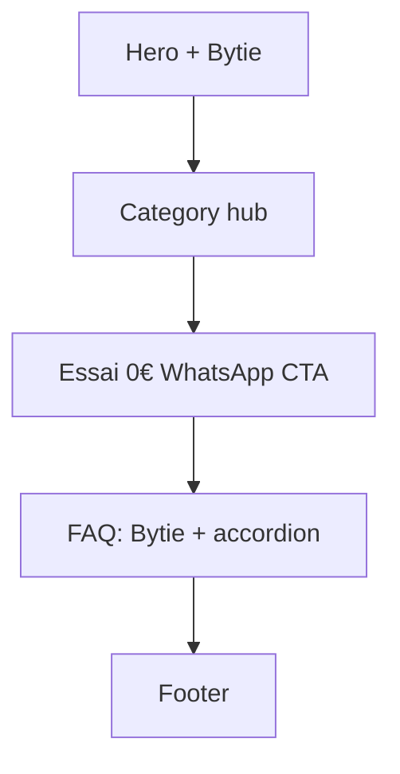

# FAQ section on the home page

## Placement and data flow

- Insert a new `<section>` **after** the existing Essai / WhatsApp CTA ([`index.html`](index.html) lines 181–199), still inside `<main>`, before the footer.
- **Static HTML only** — no `data/*.json`, no `cards.js` changes. FAQ is home-only marketing copy; category pages already carry the full price cards.
- Asset already present: [`assets/bytie-faq.webp`](assets/bytie-faq.webp) (Bytie pointing to temple — “I have the answer”).



## Layout (Bytie first)

Mirror the existing mascot pattern from category pitch blocks (e.g. [`barbiers.html`](barbiers.html) `pitch-grid--mascot`), but with FAQ-specific classes so pitch styles stay untouched.

Desktop (~900px+):

- Grid: **figure first** (Bytie), then copy column (kicker + `h2` + accordion).
- Bytie sized similarly to pitch mascots (`width`/`height` from the file, `loading="lazy"`, meaningful `alt`).

Mobile:

- Same DOM order: image on top, then questions (matches “starting with” the asset).
- Respect `prefers-reduced-motion` if any float animation is reused.

Suggested structure:

```html
<section class="faq wrap" aria-labelledby="faq-title" id="faq">
  <div class="faq-grid">
    <figure class="faq-mascot">
      
    </figure>
    <div class="faq-body">
      <p class="faq-kicker">Avant WhatsApp</p>
      <h2 id="faq-title">Questions qu’on reçoit souvent</h2>
      <div class="faq-list">
        <details>…</details>
      </div>
    </div>
  </div>
</section>
```

Interaction: native **`<details>` / `<summary>`** — accessible, no JS, fits the static architecture. Style open/closed with CSS only (border, chevron via `::after` or summary padding).

Optional SEO: one inline `<script type="application/ld+json">` FAQPage block mirroring the same Q&A (same-origin, not a third-party script). Skip if you prefer zero extra markup; easy to add later.

## Copy (7 questions — French, same voice as the hero)

Tone: concrete, no fluff, aligned with [`pricing_formulas_fr.md`](pricing_formulas_fr.md) and the home pitch (“Essai 0 € · 72 h”, “On tient la porte”). Prices in **€ HT**, with a short “TVA 21 % en sus” where a paid amount is named.

| # | Question | Answer intent |
|---|----------|----------------|
| 1 | **L’essai à 0 €, c’est vraiment gratuit ?** | Yes: clone of the chosen design with your name, live URL 72 h, WhatsApp (4 photos). No card, no catch. Not a permanent site. |
| 2 | **Que se passe-t-il après 72 h ?** | Preview expires. You choose: stop, or go to a paid offer. No automatic charge. |
| 3 | **Combien ça coûte ensuite ?** | Two paths: **L’Enseigne** 1 990 € HT once · **On tient la porte** 199 € HT / mois (12 months), then 99 €. TVA 21 % en sus. Point to a category page for the full cards. |
| 4 | **L’Enseigne ou On tient la porte — comment choisir ?** | L’Enseigne = door online in ~2 weeks, you manage after. On tient la porte = same site + photo WhatsApp → update same evening + Google posts (recommended). |
| 5 | **Le site m’appartient ?** | After L’Enseigne delivery, or after 12 months of On tient la porte — yes. Hébergement seul possible at 29 € HT / mois. |
| 6 | **Qu’est-ce que je dois envoyer pour démarrer ?** | Essai: 4 photos + name + commune + design link on WhatsApp. Paid: texts/photos/access; one round of feedback included on L’Enseigne. |
| 7 | **Vous gérez aussi Google / Maps ?** | Fiche Google Business in L’Enseigne; posts + reviews under On tient la porte. “Le créneau vide” (+ 290 € HT / mois) only after 8 weeks if they want Ads / local push. |

Closing line under the list (optional, one sentence): “Encore un doute → même WhatsApp que l’essai.” with a text link to the existing `wa.me` URL (reuse CTA href, no second float button).

**Out of FAQ (keeps it short):** bilingue (+500 €), pack identité, demi-journée photo — those stay on category pricing notes / devis.

## CSS ([`css/style.css`](css/style.css))

Add a focused block (near CTA styles):

- `.faq` — section padding (after CTA, before footer)
- `.faq-grid` — 2 columns desktop; 1 column mobile
- `.faq-mascot` / img — max-width, no black-box framing (asset already has black BG; let it sit on parchment or a soft rounded crop if needed)
- `.faq-kicker`, `.faq-body h2` — match Fraunces / ink tokens
- `.faq-list details` — white card, `var(--line)` border, radius
- `summary` — bold, keyboard-friendly focus ring, cursor pointer
- Open state: slight left accent in rust/teal consistent with pitch items

No inline styles in HTML. Mobile-first, then `@media (min-width: 900px)`.

## Files to change

| File | Change |
|------|--------|
| [`index.html`](index.html) | FAQ section + optional FAQPage JSON-LD |
| [`css/style.css`](css/style.css) | `.faq*` styles + responsive rules |
| [`assets/bytie-faq.webp`](assets/bytie-faq.webp) | Already untracked — include when committing |

**Not touched:** `js/cards.js`, category HTML, JSON data.

## Verification (after implementation)

- Local `./serve.sh` → open `/` : Bytie loads, accordion open/close, WhatsApp float still works.
- Desktop + ~375px: image-first stack, readable questions, no overflow.
- Check that CTA above FAQ and footer below are unchanged.
- Confirm prices match category cards (1 990 / 199 / 99 / +290).
