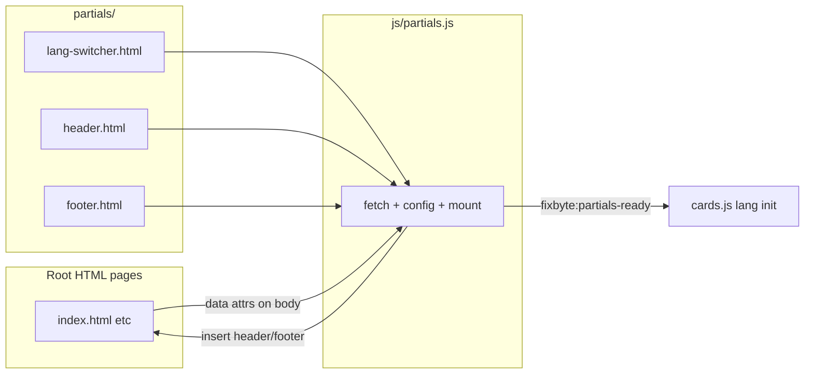

# Shared header/footer partials (runtime `partials.js`)

## Goal

Remove ~200 lines of duplicated chrome from each of the 7 templates without changing CSS, page body content, or deploy model. One source of truth in `partials/`, loaded at runtime — **no build step**, no `pages/` directory, no generated HTML.

## Why runtime JS over build script (user choice)

| | `partials.js` (chosen) | `build-pages.py` |
|---|---|---|
| Edit workflow | Edit partial → refresh browser | Edit partial → run build → commit |
| Deploy | Static files + JS fetch | Build in CI or commit generated HTML |
| SEO / no-JS | Chrome absent until JS runs | Full HTML in source |
| Fits repo rules | Extends same-origin fetch to `/partials/` | Adds build step (needs approval) |

Tradeoff accepted: brief empty header/footer flash on load; crawlers still get full `<main>` and `<head>` meta.

## Current duplication (unchanged facts)

| Block | Per-page differences |
|---|---|
| Header (~79 lines) | Active nav link; header brand sep `10` (index) vs `12` (category) |
| Lang switcher (~52 lines) | Identical; duplicated in header **and** footer |
| Footer (~150 lines) | Copyright `Fixbyte Studio` (index) vs `Fixbyte` (category) |

## Target layout



### New files

```
partials/
  lang-switcher.html
  header.html          # contains <!-- partial:lang-switcher -->
  footer.html          # contains <!-- partial:lang-switcher -->

js/partials.js
```

### Removed (not created)

- `pages/` directory
- `scripts/build-pages.py`
- Generated root HTML workflow

## Partial HTML design

### [`partials/lang-switcher.html`](partials/lang-switcher.html)
Exact copy of the lang-switcher block from [`restaurant.html`](restaurant.html) (lines 67–119).

### [`partials/header.html`](partials/header.html)
`<header class="site-header">…</header>` without lang-switcher inline — slot marker instead:

```html
<!-- partial:lang-switcher -->
```

Nav links have **no** active class baked in; `partials.js` adds `is-active` + `aria-current="page"` from config.

Brand sep size applied by JS: set `width`/`height` on `.brand-wordmark__sep` from config (`10` or `12`).

### [`partials/footer.html`](partials/footer.html)
`<footer class="site-footer">…</footer>` with:
- `<!-- partial:lang-switcher -->` inside `.footer-brand`
- `<span data-copyright></span>` placeholder for the copyright name (JS fills `Fixbyte Studio` or `Fixbyte`)

## Page changes (7 root `*.html` only)

Replace inline `<header>…</header>` and `<footer>…</footer>` with mount points. Everything else stays as-is.

```html
<body
  data-active-nav="restaurant"
  data-header-sep="12"
  data-copyright="Fixbyte"
>
  <div id="site-header" data-partial="header"></div>

  <main><!-- unchanged --></main>

  <div id="site-footer" data-partial="footer"></div>

  <script src="js/partials.js"></script>
  <script src="js/cards.js"></script>
</body>
```

**Per-page `data-*` values** (read by `partials.js` from `<body>`):

| page | `data-active-nav` | `data-header-sep` | `data-copyright` |
|---|---|---|---|
| `index.html` | *(omit / empty)* | `10` | `Fixbyte Studio` |
| `restaurant.html` | `restaurant` | `12` | `Fixbyte` |
| `barbiers.html` | `barbiers` | `12` | `Fixbyte` |
| `agences.html` | `agences` | `12` | `Fixbyte` |
| `entreprises.html` | `entreprises` | `12` | `Fixbyte` |
| `cafes.html` | `cafes` | `12` | `Fixbyte` |
| `ecommerce.html` | `ecommerce` | `12` | `Fixbyte` |

Active nav matching: link `href="restaurant.html"` gets active state when `data-active-nav="restaurant"`.

## [`js/partials.js`](js/partials.js)

Vanilla JS, same-origin fetches only (`/partials/*.html`).

**Responsibilities:**
1. Read config from `document.body` dataset
2. Fetch `lang-switcher.html` once; cache in memory
3. Fetch `header.html` / `footer.html`; replace `<!-- partial:lang-switcher -->` with cached lang-switcher HTML
4. Parse with `DOMParser` (not `innerHTML` on `document`) and mount into `#site-header` / `#site-footer`
5. Apply post-mount tweaks:
   - Active nav link class + `aria-current`
   - Header brand sep dimensions
   - Footer `[data-copyright]` text
6. Dispatch `document.dispatchEvent(new CustomEvent('fixbyte:partials-ready'))`

**Error handling:** if a partial fetch fails, log a clear console error; page remains usable (main content unaffected).

## Minimal [`js/cards.js`](js/cards.js) change

`initLangSwitchers()` currently runs on load but switchers won't exist until partials mount.

Change only the lang-switcher init timing:

```js
document.addEventListener('fixbyte:partials-ready', initLangSwitchers);
// keep existing card-grid init on DOMContentLoaded as today
```

No other cards.js logic changes.

## CI / validation (no build)

### [`.github/workflows/validate.yml`](.github/workflows/validate.yml)
Add PR paths: `partials/**`, `js/partials.js`, `*.html`.

Add step: `python3 scripts/validate-partials.py` — checks:
- `partials/{header,footer,lang-switcher}.html` exist
- Each of the 7 root HTML files has `#site-header`, `#site-footer`, `js/partials.js` script
- No leftover inline `<header class="site-header">` or `<footer class="site-footer">` in root pages

### [`.github/workflows/pages.yml`](.github/workflows/pages.yml)
**No build step.** Ensure `partials/` is **included** in rsync (do not exclude).

### [`serve.sh`](serve.sh)
No changes needed.

## What will NOT change

- [`css/style.css`](css/style.css) — no FOUC-hiding styles unless a visible flash becomes a problem later
- `<main>` content and page-specific `<head>` meta on all 7 pages
- `data/*.json`, assets, card rendering logic
- No npm, no frameworks, no build tools

## Cleanup (no dead code)

After migration each root `*.html`:
- Has **no** inline header/footer/lang-switcher markup
- Has mount points + body data attrs + `partials.js` script tag

Remove entirely:
- Any duplicated chrome HTML from the 7 pages
- No orphan `pages/` or `build-pages.py` from the previous plan

`partials/` is the sole HTML source for shared chrome.

## Contributor workflow (post-change)

1. Edit shared chrome → `partials/*.html`
2. Edit page content/meta → root `*.html` (main/head only)
3. Refresh browser — no build step

## Note on project rules

[`AGENTS.md`](AGENTS.md) currently limits fetches to `/data/*.json`. This plan intentionally extends same-origin fetches to `/partials/*.html` for layout only — document in a one-line AGENTS.md addendum when implementing.
